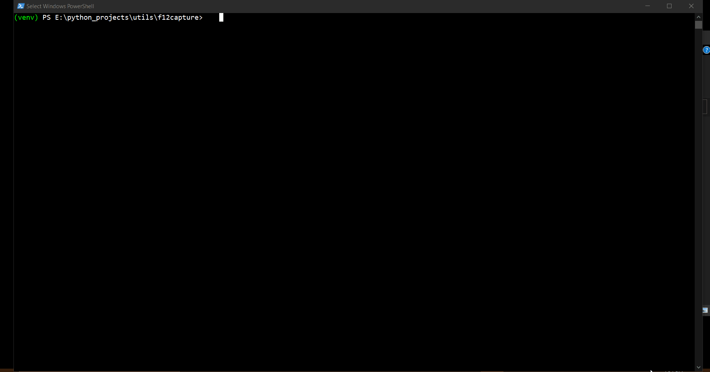

# f12capture

Captures network data (chromium -> dev tools (f12)) for xhr calls. Multiple options for filtering, storing output etc.
Refer --help option for more details

#  Sample Usage

## More features coming:

*   Support for login to websites that require sign in
*   More filtering support

